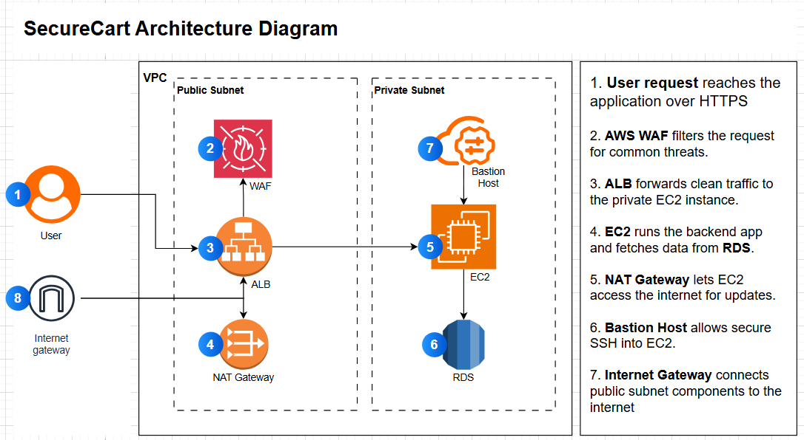

# Secure Application Deployment on AWS (Security Pillar)

## 📌 Project Overview
SecureCart is an e-commerce platform that initially prioritized speed over security, leaving critical resources exposed to the public internet. This project demonstrates how to transform an insecure architecture into a secure, production-grade environment using AWS services and best practices aligned with the **AWS Well-Architected Framework**.

---
## 🏗️ Architecture Overview

---

## 🎯 Objectives
- Isolate backend resources in private subnets
- Enforce least privilege using IAM and Security Groups
- Enable encryption at rest and in transit
- Protect against common web exploits using AWS WAF
- Implement a layered security model for defense-in-depth

---

## 🛠 AWS Services Used
- **Amazon VPC** – Custom VPC with public/private subnets
- **Amazon EC2** – Application backend in private subnet
- **Amazon RDS** – Encrypted MySQL database in private subnet
- **Amazon S3** – Private object storage
- **Application Load Balancer (ALB)** – Public endpoint for app
- **AWS WAF** – Web application firewall for Layer 7 protection
- **AWS IAM** – Role-based access control
- **AWS CloudFront** – Secure content delivery

---

## 🔐 Security Best Practices Implemented
- **Network Isolation:** EC2 and RDS in private subnets
- **Controlled Access:** Security Groups allow only necessary traffic
- **Encryption:** Data at rest (RDS, S3) and in transit (HTTPS)
- **Defense-in-Depth:** Multiple layers of security (WAF, subnet restrictions)
- **Principle of Least Privilege:** IAM roles and policies
